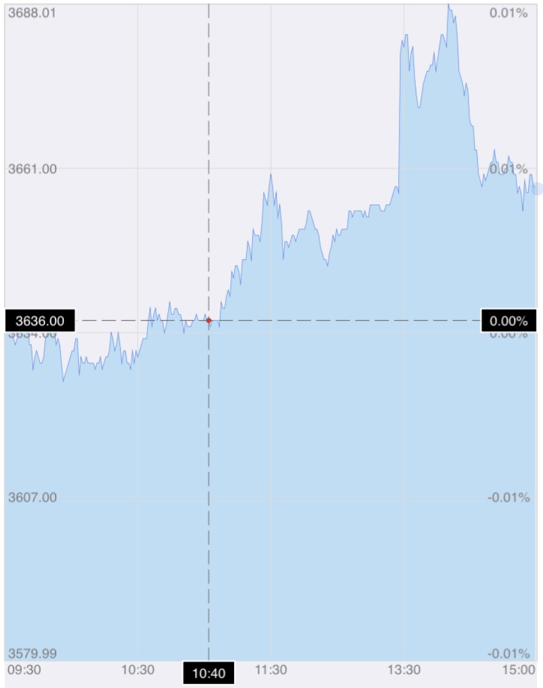
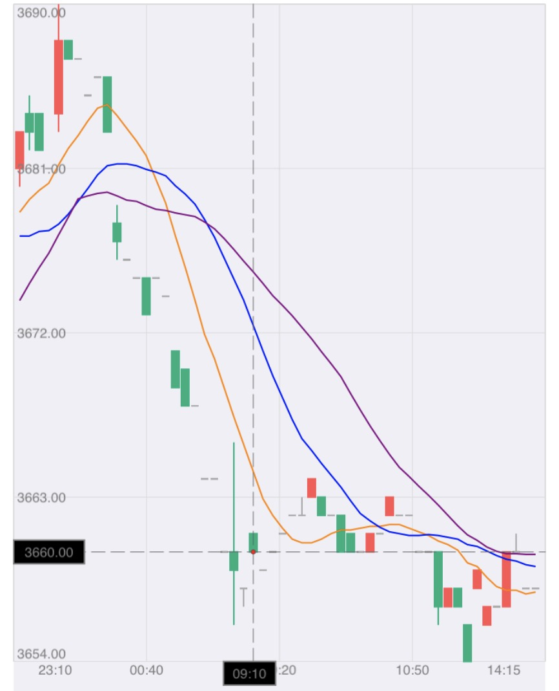
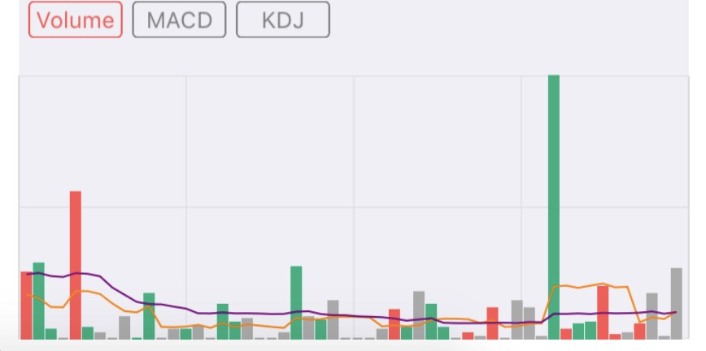
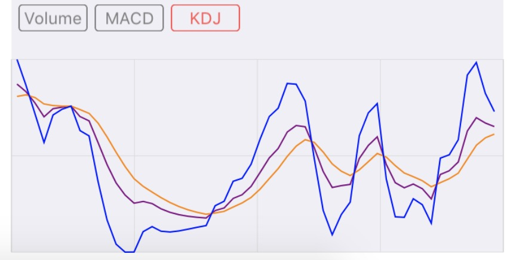

# FL_StockChart


利用 CAShapeLayer + UIBezierpath 写的K线图Demo.

```objective-c
//分时线的创建方法
 FLTimeChartView *timeChartView = [[FLTimeChartView alloc]initWithFrame:CGRectMake(0, 0, CGRectGetWidth(frame), CGRectGetHeight(frame) * 0.75 - 20) StockGroupModel:self.stockModelArray];
 [self.view addSubview:timeChartView];

 //分时线开始绘制
[self.timeChartView startDrawTimeChart];
 ```


 ```objective-c
 //k线的创建方法
 FLKLineChartView *kLineChartView = [[FLKLineChartView alloc]initWithFrame:CGRectMake(0, 0, CGRectGetWidth(frame), CGRectGetHeight(frame) * 0.75 - 20)];
 self.kLineChartView.delegate = self;
 [self.view addSubview:kLineChartView];
 
 //设置数据
 [kLineChartView setKLineChartWithModel:self.stockModelArray];
 
 //k线开始绘制
 [self.kLineChartView drawKLineChart];
 ```
 
 ```objective-c
 //副图-指标
 FLAccessoryChartView *accessoryChartView = [[FLAccessoryChartView alloc]initWithFrame:CGRectMake(0, CGRectGetHeight(frame) * 0.75, CGRectGetWidth(frame), CGRectGetHeight(frame) * 0.25)];
 [self.view addSubview:accessoryChartView];
 
 //设置需要绘制的model - 直接绘制
 [accessoryChartView setAccessoryChartDataSource:needDrawModels];
 ```

#### Time-sharingplan
{:height="50%" width="50%"}

#### K-line
{:height="50%" width="50%"}

#### Indicator - Volume


#### Indicator - MACD


#### Indicator - KDJ

